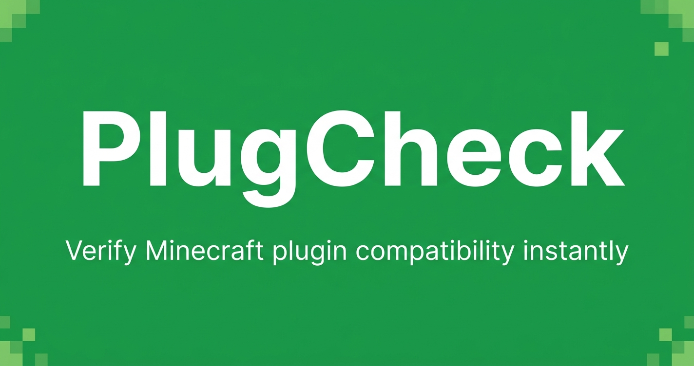

# PlugCheck



Paste a plugin name (or drop a .jar), pick your Minecraft version and platform, and find out if it's compatible. Results come from Hangar, SpigotMC, and Modrinth. No accounts, no uploads.

## How it works

You enter a plugin name or drop a .jar into the checker. PlugCheck queries Hangar, Spiget (SpigotMC API), or Modrinth depending on the platform you pick, then compares the plugin's declared supported versions against the version you selected.

Each plugin comes back as compatible, incompatible, unknown, or abandoned. "Abandoned" means no GitHub commit in 18 months.

The results depend on what authors actually publish to the registries. If a plugin only exists as a forum post or the author never updated their Hangar listing, you'll get "unknown."

.jar files are parsed in the browser. The actual file never leaves your machine — only the extracted metadata (name, version, declared dependencies) goes to the API.

## Local setup

```bash
pnpm install
```

Create `.env.local`:

```env
UPSTASH_REDIS_REST_URL=your_url_here
UPSTASH_REDIS_REST_TOKEN=your_token_here
GITHUB_TOKEN=your_pat_here   # fine-grained PAT, Public Repositories read access
```

```bash
pnpm dev   # http://localhost:3000
```

## Tests

```bash
pnpm test
```

73 tests across 6 files — aggregator, conflict detector, cache, and the individual API clients.

## Stack

- Next.js 15 (App Router) + TypeScript strict
- Tailwind CSS v4 + shadcn/ui
- JSZip for client-side JAR parsing
- Upstash Redis (6h cache TTL per plugin/version/platform)
- Vitest
